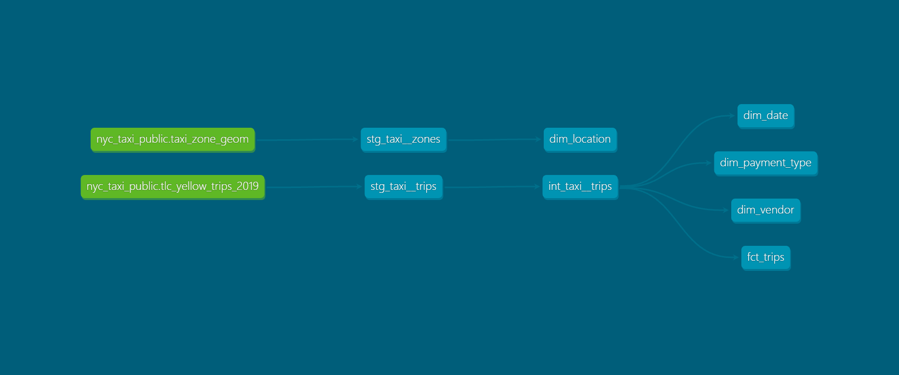

## Linhagem do pipeline

O gráfico acima é gerado automaticamente por `dbt docs generate` e mostra
as dependências de **compilação** entre models (via `ref()`/`source()`).

Um ponto que chama atenção: `dim_location` aparece como um ramo isolado,
sem seta visível até `fct_trips`. Isso não é um erro — é reflexo de uma
decisão de modelagem deliberada. Seguindo o padrão de star schema
(Kimball), `fct_trips` armazena apenas as chaves estrangeiras
(`pickup_location_id`, `dropoff_location_id`) como IDs simples, sem
"achatar" atributos descritivos das dimensões (nome de zona, bairro, etc.)
dentro da fato — o join acontece na ponta de consumo, quando necessário.

Como não há `JOIN` físico no SQL de `fct_trips` contra `dim_location`, o
dbt não desenha essa dependência no gráfico de linhagem (que rastreia
apenas relações de compilação). A integridade referencial entre as duas
tabelas é garantida por um teste `relationships` dedicado (ver
`models/marts/schema.yml`), não por uma dependência estrutural do model.

Essa é uma diferença importante entre "dependência de compilação" (o que
o gráfico mostra) e "relacionamento lógico do modelo dimensional" (o que
os testes garantem) — e uma escolha consciente de manter a fato leve,
seguindo o padrão de star schema clássico.